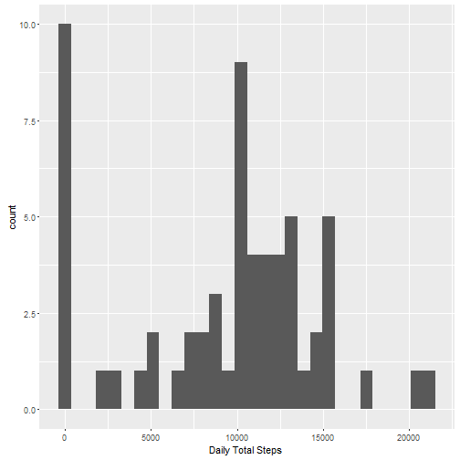

---
title: "Reproducible Research: Peer Assessment 1"
output: 
  html_document:
    keep_md: true
---


## Loading and preprocessing the data

```r
unzip (zipfile = "./activity.zip")
activityData <- read.csv("./activity.csv", header = TRUE)
summary(activityData)
```

```
##      steps                date          interval     
##  Min.   :  0.00   2012-10-01:  288   Min.   :   0.0  
##  1st Qu.:  0.00   2012-10-02:  288   1st Qu.: 588.8  
##  Median :  0.00   2012-10-03:  288   Median :1177.5  
##  Mean   : 37.38   2012-10-04:  288   Mean   :1177.5  
##  3rd Qu.: 12.00   2012-10-05:  288   3rd Qu.:1766.2  
##  Max.   :806.00   2012-10-06:  288   Max.   :2355.0  
##  NA's   :2304     (Other)   :15840
```

## What is mean total number of steps taken per day?

```r
library(ggplot2)
stepsPerDay <- aggregate(activityData$steps, by = list(activityData$date), FUN = sum, na.rm=TRUE)
names(stepsPerDay) <- c("date","totalsteps")
totalStepsHist <- ggplot(data=stepsPerDay, aes(totalsteps)) + geom_histogram()
totalStepsHist <- totalStepsHist + xlab("Daily Total Steps ")
print(totalStepsHist)
```

```
## `stat_bin()` using `bins = 30`. Pick better value with `binwidth`.
```



```r
meanTotalSteps <- mean(stepsPerDay$totalsteps, na.rm = TRUE)
meanTotalSteps
```

```
## [1] 9354.23
```

```r
medianTotalSteps <- median(stepsPerDay$totalsteps, na.rm = TRUE)
medianTotalSteps
```

```
## [1] 10395
```
#### Mean total number of steps taken per day is: 9354.2295082

## What is the average daily activity pattern?

```r
meanIntervalSteps <- aggregate(activityData$steps, by = list(activityData$interval), FUN = mean, na.rm=TRUE)
names(meanIntervalSteps) <- c("interval","average")
meanStepsPlot <- ggplot(data=meanIntervalSteps, aes(x=interval,y=average))
meanStepsPlot <- meanStepsPlot + geom_line() + xlab("5 Min Interval") + ylab("Avg Steps")
meanStepsPlot
```


```r
maxStepsIn5MinInter <- meanIntervalSteps[which.max(meanIntervalSteps$average),]
maxStepsIn5MinInter
```

```
##     interval  average
## 104      835 206.1698
```
#### The 5 minute interval  with max steps is: 835


## Imputing missing values

```r
missingRowInfo <- table(is.na(activityData))
names(missingRowInfo) <- c("NonNARows", "NAs")
missingRowInfo
```

```
## NonNARows       NAs 
##     50400      2304
```

```r
fillNAs <- function(steps, interval) {
  ifelse(is.na(steps), meanIntervalSteps[meanIntervalSteps$interval == interval,  "average"], c(steps))
}
filledData <- activityData
filledData$steps <- mapply(fillNAs, filledData$steps, filledData$interval)

newStepsPerDay <- aggregate(filledData$steps, by = list(filledData$date), FUN = sum)
names(newStepsPerDay) <- c("date","totalsteps")
ntotalStepsHist <- ggplot(data=newStepsPerDay, aes(totalsteps)) + geom_histogram()
ntotalStepsHist <- ntotalStepsHist + xlab("Filled Dail Total Steps ")
print(ntotalStepsHist)
```

```
## `stat_bin()` using `bins = 30`. Pick better value with `binwidth`.
```


```r
newMeanTotalSteps <- mean(newStepsPerDay$totalsteps)
newMeanTotalSteps
```

```
## [1] 10766.19
```

```r
newMedianSteps <- median(newStepsPerDay$totalsteps)
newMedianSteps
```

```
## [1] 10766.19
```
#### Imputing the data impacted the outcome, average total steps was: 9354.2295082 it has increased to: 1.0766189 &times; 10<sup>4</sup> 

## Are there differences in activity patterns between weekdays and weekends?
### Based on chart below, Weekend activity is more compared to weekdays. The activity during the weekdays tend to happen in the early portion of the 5 minute interval

```r
filledData$dayType <- ifelse(weekdays(as.Date(filledData$date)) == c("Sunday","Saturday"),"Weekend","Weekday")

weekAvgs <- aggregate(filledData$steps, by = list(filledData$interval, filledData$dayType), FUN = mean)
names(weekAvgs) <- c("interval","dayType","average")
weekPlot <- ggplot(weekAvgs, aes(interval,average))
weekPlot <- weekPlot + geom_line() + facet_grid(dayType~.) +
  labs(title="Week Patterns)",x="5 Min Interval",y="Avg Steps")
print(weekPlot)
```


